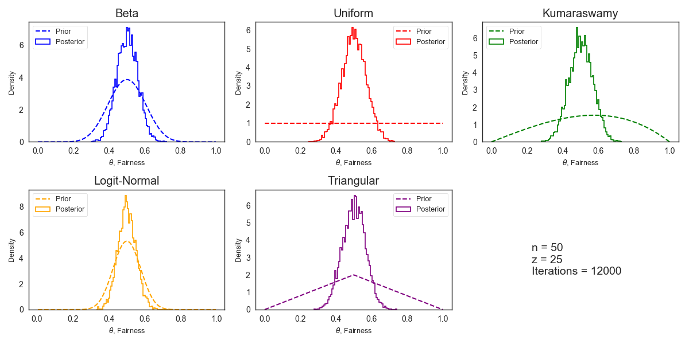
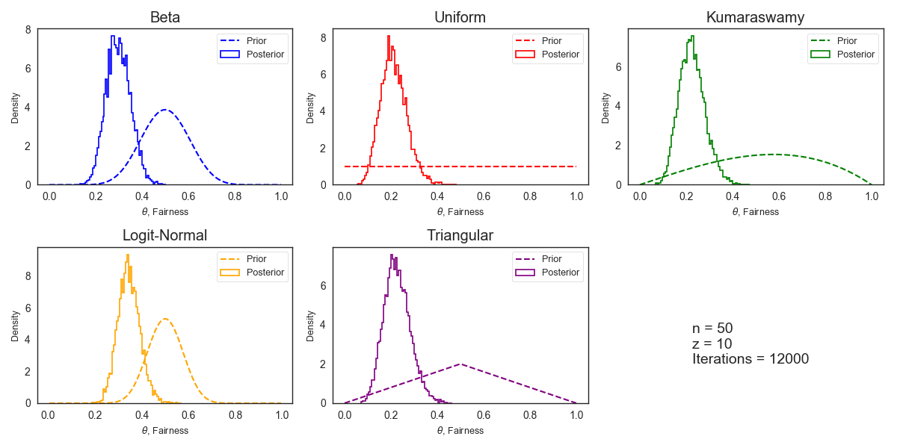
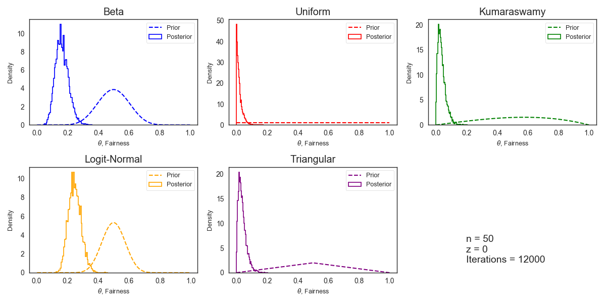
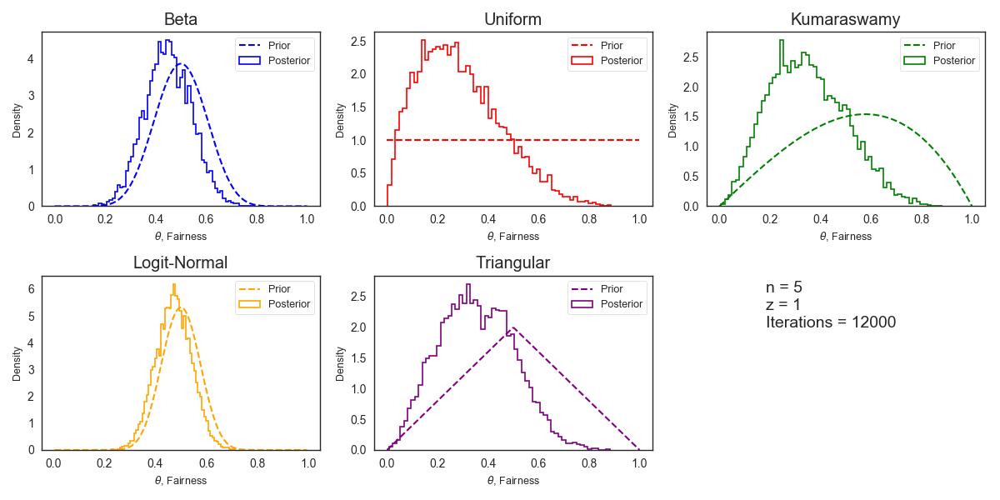
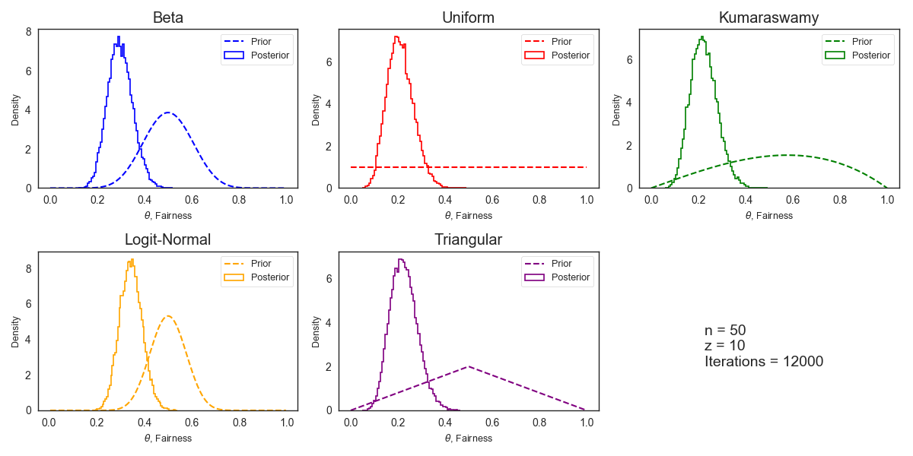
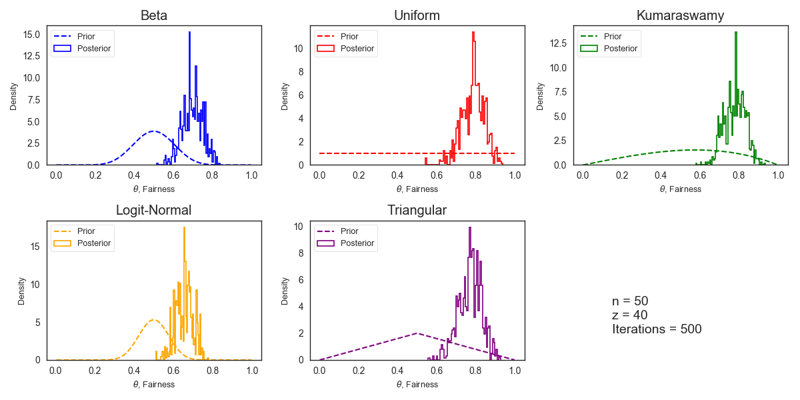
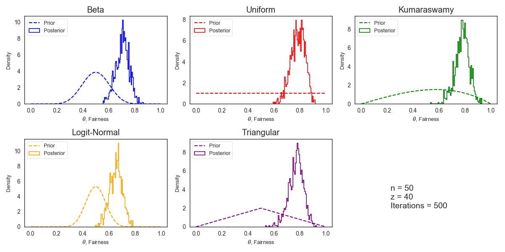

# __Homework 11__
Cody Heiser, 10Dec2018  

## __Part A__
I built my script, `Heiser_11.py` to generate plots with various priors and Markov Chain Monte Carlo (MCMC)-simulated posterior distributions for an event with two possible outcomes given parameters _n (total observations)_, _z (observed "heads")_, and the number of iterations to run for MCMC.  You can also specify the step method algorithm for `PyMC3` to use.  For this part, I used the **Metropolis** step algorithm with __12,000__ iterations.
```
usage: Heiser_11.py [-h] [-alg ALG] iter n z

Bayesian inference testing with Markov Chain Monte Carlo

positional arguments:
  iter        How many MCMC iterations to run
  n           How many total coin flips?
  z           How many Heads observed in n coin flips?

optional arguments:
  -h, --help  show this help message and exit
  -alg ALG    Step method algorithm to use ("Metropolis" or "NUTS")
```
Running this for a "fair coin", or with conditions _n_=50 and _z_=25, for example, all posteriors tend to converge with a mean around 0.5, as expected:  
  

If you skew the observations, however, as in the case of an unfair coin, some priors do a better job of allowing the posterior to reflect the actual percentages of heads and tails in the dataset.  In this case, with _n_=50 and _z_=10, the __Uniform__, __Kumaraswamy__, and __Triangular__ priors yield posterior distributions centered around 0.2 - the observed frequency of 1 in 5 -  while the __Beta__ and __Logit-Normal__ priors are skewed closer to 0.5:  
  

To exaggerate this even further, we can feed the algorithm data with _z_=0 to simulate a completely fixed coin.  Here we see more of the same. The __Beta__ and __Logit-Normal__ priors do not yield posterior distributions that reflect the data accurately.  This is probably because these distributions are much narrower, while the __Uniform__, __Kumaraswamy__, and __Triangular__ priors have larger standard deviations, which removes the bias when calculating the posterior.  
  

Furthermore, we can lower the number of observations drastically and see that the narrower prior distributions (__Beta__ and __Logit-Normal__) are much further away from an expected value of 0.2 for _n_=5 and _z_=1, while prior distributions with a larger range of probability values are more greatly influenced by the observed data, even if there is much less of it:  
  

Under these conditions, the __Uniform__ prior appears to perform the best in allowing the posterior to reflect the observed data, as it does not bias the distribution toward a specific, narrow range of values.  

## __Part B__
Using the same script from Part A, I tested the NUTS step method algorithm as a replacement for the Metropolis algorithm. The resulting histograms for the same data and number of iterations is smoother than the Metropolis histograms for all posterior distributions (compare to second example in Part A above):  
  

This algorithm was developed to intelligently adjust the number of steps and step size as an improvement over traditional Hamiltonian Monte Carlo (HMC) random-walk algorithms such as the Metropolis method [(Hoffman & Gelman, 2014)](http://www.jmlr.org/papers/volume15/hoffman14a/hoffman14a.pdf).  The idea was to avoid having to "fine-tune" the step size and iterations to optimize the MCMC process.

For example, if we run __500__ iterations with the __Metropolis__ algorithm, we don't get the best resulting distributions:  
  

However, __500__ iterations with the __NUTS__ algorithm yields a fairly smooth, representative posterior centered around the expected value (depending on the appropriateness of the prior):
  

In this way, the NUTS algorithm successfully "smooths" the resulting probability distributions, especially when given a smaller number of iterations to perform.  This could be advantageous to save computation time and yield a more accurate posterior distribution.
